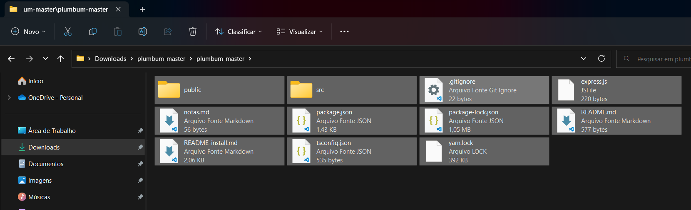

# 📝 Plumbum | Plataforma de construção de textos: investigação e construção de recursos 

O presente projeto está sendo desenvolvido no âmbito do Grupo de Pesquisa Mosaico no Instituto Federal da Bahia, Campus Camaçari. A plataforma utiliza como base React com TypeScript.  
## Passo a passo para deploy

### **Observação:** As instruções abaixo foram utilizadas para implementar a plataforma em um computador com Windows. Tais informações podem variar dependendo do SO do usuário.

1. Para prosseguir é necessário possui o *Node.js* instalando no seu computador. Caso não possua realize o download e instalação pelo link:
https://nodejs.org/en/. 
Versão mínima: 18.12.1
2. Em seguida vamos criar uma nova pasta para o projeto. Como utilizaremos bastante o **cmd** iremos criar a pasta por lá.
- Utilize o atalho Windows + R para abrir o Executar.
- Em seguida digite **cmd** e pressione Enter.
3. Para criar uma nova pasta pelo Prompt de Comando, insira o comando *mkdir [nome da pasta desejada]* e pressione Enter. Não crie uma pasta com o nome *plumbum*, mais pra frente explicaremos o motivo. 
Vamos criar a pasta *projetos*:
~~~
mkdir projetos
~~~
4. Para acessar a pasta, utilize o comando:
~~~
cd projetos
~~~
5. Seguindo todos os passos acima, a última linha do seu Terminal deve ser:
~~~
C:\Users\[user]\projetos> 
~~~
6. Agora vamos criar o projeto em React.ts. Para isso dê o seguinte comando e aguarde a finalização:
~~~
npx create-react-app plumbum --template typescript
~~~
7. Pronto, projeto criado. Agora vamos colocar o *Plumbum* aqui, para isso realize o donwload da pasta zip do projeto aqui mesmo no GitHub. Toque em "Code" e em seguida "Download ZIP". Extraia os arquivos. E seguida vamos pegar os arquivos, e mover para a pasta do projeto
**Atenção:** Não copie e pasta extraída, e sim **os arquivos** que estão dentro da pasta:
   

 
 8. Feito isso basta agora realizar a instalação de algumas bibliotecas que estão sendo utilizadas na plataforma.
 - De volta ao Prompt de Comando vamos acessar a pasta do projeto. Basta dar o seguinte comando:
~~~
cd plumbum
~~~
A última linha do seu *cmd* deve ser a seguinte:
~~~
C:\Users\emnfe\projetos\plumbum>
~~~
9. Em seguida execute os seguintes comandos, um após o outro:

- Instalação do *React Router DOM*
~~~
npm install react-router-dom
~~~

- Instalação do *Axios* (rotas)
~~~
npm install axios
~~~

- Instalação das bibliotecas do *Material UI* (componentes e ícones)
~~~
npm install @mui/material @emotion/react @emotion/styled
~~~
~~~
npm install @mui/icons-material
~~~

10. Pronto, após e execução de todos os código acima a plataforma está com a implementação completa. Para visualizá-la, informe o último comando (e que sempre será utilizado para acessar a plataforma) desse guia:
~~~
npm start
~~~
## API para conexão com banco de dados

[Repositório do Plumbum API](https://github.com/emn-f/plumbum-api)
